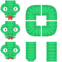
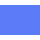
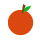

# Snake Game

A classic Snake game built in **C++** with a **Dear ImGui + DirectX 11** graphical frontend,
fully buildable in **Visual Studio 2022**.

---

## Preview — Sprite Sheet

<p align="center">
  
</p>

---

## What the Snake Looks Like

The snake is assembled from individual directional sprites each frame:

<table align="center">
  <tr>
    <td align="center"><br/><sub>tail</sub></td>
    <td align="center"><br/><sub>body</sub></td>
    <td align="center"><br/><sub>corner</sub></td>
    <td align="center"><br/><sub>body</sub></td>
    <td align="center"><br/><sub>corner</sub></td>
    <td align="center"><br/><sub>body</sub></td>
    <td align="center"><br/><sub>head →</sub></td>
    <td align="center"><br/><sub>apple</sub></td>
  </tr>
</table>

---

## Head Sprites (all 4 directions)

<table align="center">
  <tr>
    <td align="center"><br/><sub>▲ Up</sub></td>
    <td align="center"><br/><sub>▼ Down</sub></td>
    <td align="center"><br/><sub>◄ Left</sub></td>
    <td align="center"><br/><sub>► Right</sub></td>
  </tr>
</table>

---

## Body & Corner Sprites

<table align="center">
  <tr>
    <th>Horizontal</th>
    <th>Vertical</th>
    <th>Top-Right</th>
    <th>Top-Left</th>
    <th>Bottom-Right</th>
    <th>Bottom-Left</th>
  </tr>
  <tr>
    <td align="center"></td>
    <td align="center"></td>
    <td align="center"></td>
    <td align="center"></td>
    <td align="center"></td>
    <td align="center"></td>
  </tr>
</table>

---

## Tail Sprites (all 4 directions)

<table align="center">
  <tr>
    <td align="center"><br/><sub>▲ Up</sub></td>
    <td align="center"><br/><sub>▼ Down</sub></td>
    <td align="center"><br/><sub>◄ Left</sub></td>
    <td align="center"><br/><sub>► Right</sub></td>
  </tr>
</table>

---

## Food Sprite

<p align="center">
  
  &nbsp;&nbsp;
  
  &nbsp;&nbsp;
  
  &nbsp;&nbsp;
  
  &nbsp;&nbsp;
  
</p>

> Five apples are on the board at all times, each tinted a different colour by the renderer.

---

## Features

| Feature | Detail |
|---|---|
| **Graphics** | Dear ImGui draw lists + DirectX 11 — no console, real GPU rendering |
| **Sprites** | 16 CC0 PNG sprites (head × 4, body straight × 2, corner × 4, tail × 4, apple) |
| **Mouth animation** | Snake head opens its mouth one cell before reaching food |
| **5 live apples** | A replacement apple spawns instantly when one is eaten |
| **Gradient body** | Body segments fade from bright green at the neck to dark green at the tail |
| **Smooth corners** | Correct corner sprite chosen automatically at every turn |
| **Fallback renderer** | If sprites fail to load, the game falls back to ImGui primitive drawing |
| **Resizable window** | Board stays centred as you resize the window |

---

## Requirements

| Tool | Version |
|---|---|
| Visual Studio | 2022 (any edition — Community works fine) |
| Windows SDK | 10.0 or later (ships with VS) |
| DirectX 11 | Included in the Windows SDK |
| C++ standard | C++17 |

No external package manager or NuGet packages are needed. All dependencies
(`Dear ImGui`, `stb_image`) are bundled in the repository.

---

## How to Build

```
1. Open  SnakeGame.sln  in Visual Studio 2022
2. Select configuration:  Debug | x64  (or Release | x64)
3. Press  Ctrl + Shift + B  to build
4. Press  Ctrl + F5  to run (Start Without Debugging)
```

A native Win32 window opens — no console window appears.

> **Working directory note:** Visual Studio sets the working directory to the
> project folder (`SnakeGame\`) when launched with F5 / Ctrl+F5, so sprites
> are found automatically at `assets\`. If you copy the `.exe` elsewhere,
> copy the `assets\` folder alongside it.

---

## Controls

| Key | Action |
|---|---|
| `W` / `↑` | Move up |
| `S` / `↓` | Move down |
| `A` / `←` | Move left |
| `D` / `→` | Move right |
| `Enter` / `Space` | Start game (from title screen) |
| `R` | Restart (from game-over screen) |
| `Q` | Quit (from game-over screen) |
| `Esc` | Quit (any screen) |

---

## Project Structure

```
snake/
├── README.md                        ← you are here
├── SnakeGame.sln                    ← Visual Studio solution
└── SnakeGame/
    ├── main.cpp                     ← Win32 window + DX11 device + ImGui init + game loop
    ├── Game.h / Game.cpp            ← game logic, sprite loading, ImGui rendering
    ├── Snake.h / Snake.cpp          ← snake entity (deque of Points, movement, collision)
    ├── Renderer.h                   ← ImGui DrawList helpers (colours, cell drawing)
    ├── SpriteRenderer.h             ← SpriteSet struct + DrawSprite() helper
    ├── TextureLoader.h              ← PNG → D3D11 texture loader (stb_image)
    ├── assets/
    │   ├── head_up/down/left/right.png
    │   ├── body_horizontal.png
    │   ├── body_vertical.png
    │   ├── body_topright/topleft/bottomright/bottomleft.png
    │   ├── tail_up/down/left/right.png
    │   └── apple.png
    └── imgui/
        ├── imgui.h / .cpp           ← Dear ImGui core
        ├── imgui_impl_win32.h / .cpp← Win32 backend
        ├── imgui_impl_dx11.h / .cpp ← DirectX 11 backend
        └── stb_image.h              ← single-header PNG decoder
```

---

## Architecture

```
main.cpp
  │
  ├─ Creates Win32 window (WndProc → ImGui_ImplWin32_WndProcHandler)
  ├─ Creates D3D11 device + swap chain
  ├─ Initialises ImGui (Win32 + DX11 backends)
  ├─ Calls game.LoadSprites(device)   ← TextureLoader → stb_image → ID3D11SRV
  │
  └─ Per-frame loop ──────────────────────────────────────────────────────────
       PeekMessage / TranslateMessage / DispatchMessage
       ImGui_ImplDX11_NewFrame()
       ImGui_ImplWin32_NewFrame()
       ImGui::NewFrame()
         game.ProcessInput()   ← ImGui::IsKeyDown / IsKeyPressed
         game.Update()         ← 200 ms fixed tick via std::chrono
         game.Render(w, h)
           ├─ Background fill (ImGui background draw list)
           ├─ DrawBoard()       ← board rect + subtle grid lines
           ├─ DrawFood()        ← apple sprites (tinted × 5 colours)
           ├─ DrawSnake()       ← tail / corner / body / head sprites
           └─ DrawHUD()         ← score + length (ImGui overlay window)
       ImGui::Render()
       ImGui_ImplDX11_RenderDrawData()
       SwapChain->Present(1, 0)
```

---

## Credits

| Asset | Source | Licence |
|---|---|---|
| Snake sprites | [OpenGameArt.org — snake_graphics](https://opengameart.org/content/snake-game-assets) | CC0 (public domain) |
| Dear ImGui | [ocornut/imgui](https://github.com/ocornut/imgui) | MIT |
| stb_image | [nothings/stb](https://github.com/nothings/stb) | Public domain / MIT |
